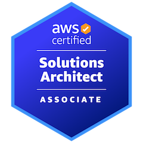

# AWS Cloud Architect          

## Empowering Organizations with Scalable, Flexible, and Resilient Cloud Architectures

Welcome to my architectural showcase, demonstrating expertise in designing and implementing robust, scalable, and efficient cloud solutions on Amazon Web Services (AWS). This portfolio highlights my ability to leverage cloud-native services for automated workflows, dynamic infrastructure management, complex data processing, and building highly available, loosely coupled systems.

### My Architectural Philosophy:
I am committed to building systems that are not just high-performing but also resilient, maintainable, and optimized for operational excellence. My core principles include:

Cloud-Native Adoption: Maximizing the inherent capabilities of cloud services to reduce operational overhead and accelerate innovation.

Serverless First: Prioritizing serverless components for automatic scaling, pay-as-you-go cost models, and reduced infrastructure management.

Event-Driven Architectures: Designing loosely coupled systems that react to events, enhancing flexibility and responsiveness.

Automated Deployment: Utilizing Infrastructure as Code (IaC) tools like AWS Serverless Application Model (SAM) for consistent, repeatable, and efficient deployments.

Dynamic Scaling: Implementing automated scaling mechanisms to adapt to fluctuating demand and optimize resource utilization.

Security by Design: Integrating robust security measures and best practices from the foundational stages of architecture.

### Core Competencies:
Cloud Architecture: AWS (S3, Lambda, API Gateway, SQS, SES, Route 53, EC2, Auto Scaling, CloudWatch, SNS, IAM, Kinesis, DynamoDB, RDS)

Monitoring & Alerting: Implementing comprehensive monitoring with CloudWatch and configuring alarms for proactive issue detection.

Identity & Access Management (IAM): Designing and managing user, group, and policy permissions for secure AWS access.

Automated Workflows: Designing and implementing event-driven file processing and notification systems.

Email Automation: Integrating with email services for notifications and reply handling.

DNS & Domain Management: Configuring DNS records and hosted zones with Route 53.

Dynamic Scaling: Designing and implementing automated scaling solutions.

Messaging & Decoupling: Designing and implementing asynchronous communication patterns.

Real-time Data Processing: Designing and implementing streaming data pipelines.

Serverless Computing: Developing and deploying serverless applications and functions.

Infrastructure as Code: AWS Serverless Application Model (SAM).

Data Management: NoSQL databases (DynamoDB), Relational Databases (RDS).

Python Development: Backend logic and application simulators.

Frontend Development: HTML, CSS, JavaScript.

### Certifications & Achievements:
AWS Certified Solutions Architect – Associate (Amazon, May 2025) 

AWS Cloud Technical Essentials (Simplilearn, Training)

AWS Database Migration (Simplilearn, Training)

AWS Master's Cloud Architect (Simplilearn, Feb 2025)

AWS Solutions Architect Associate Level (Simplilearn, Training)

AWS SysOps Associate, Developer Associate (Simplilearn, Training)

## Featured Projects:
### 1. EC2 Monitoring & IAM Access Management
This project demonstrates essential operational practices on AWS: monitoring EC2 instance performance with CloudWatch alarms and managing user access securely with IAM Groups and Users. It showcases how to set up proactive alerts for infrastructure health and define granular permissions for cloud resources.

[Explore the EC2 Monitoring & IAM Management Project Details]

### 2. Automated File Processing & Email Notification System
This project demonstrates an automated file processing and email notification system on AWS. It showcases how to upload files to S3, trigger serverless processing with Lambda, send email notifications via SES, and handle email replies (e.g., for file deletion) using SQS and Lambda.

[Explore the File Processing & Email Automation Project Details]

### 3. Dynamic EC2 Scaling with Auto Scaling & CloudWatch
This project showcases the implementation of dynamic scaling for EC2 instances using AWS Auto Scaling and custom CloudWatch metrics. It demonstrates how to automatically adjust compute capacity in response to application load, ensuring optimal performance and cost efficiency.

[Explore the Dynamic EC2 Scaling Project Details]

### 4. Loosely Coupled Architecture with AWS SQS
This project demonstrates a Loosely Coupled Architecture utilizing AWS SQS, a fundamental pattern for building resilient and scalable distributed systems. This project illustrates how message queuing can decouple applications, preventing cascading failures and improving overall system availability.

[Explore the Loosely Coupled SQS Architecture Project Details]

### 5. Real-time Data Pipeline for Network Optimization
This project demonstrates a robust Real-time Data Pipeline, designed to manage high-volume, real-time data for continuous network topology optimization. It exemplifies building a data ingestion and warehousing solution using AWS Kinesis and DynamoDB.

[Explore the Real-time Data Pipeline Project Details]

### Why Work With Me?
I deliver architectural solutions that bridge technical vision with critical business needs, enabling organizations to harness the power of their data and operate with unprecedented agility. My focus is on creating architectures that are not only powerful today but are also adaptable for the evolving challenges of tomorrow.

### Contact:
Feel free to connect with me to discuss architectural challenges or opportunities:

📧 **Email:** [krunalnayak1409@gmail.com](mailto:krunalnayak1409@gmail.com)
🌐 **LinkedIn:** [Krunal Nayak](https://www.linkedin.com/in/krunalnayak)
