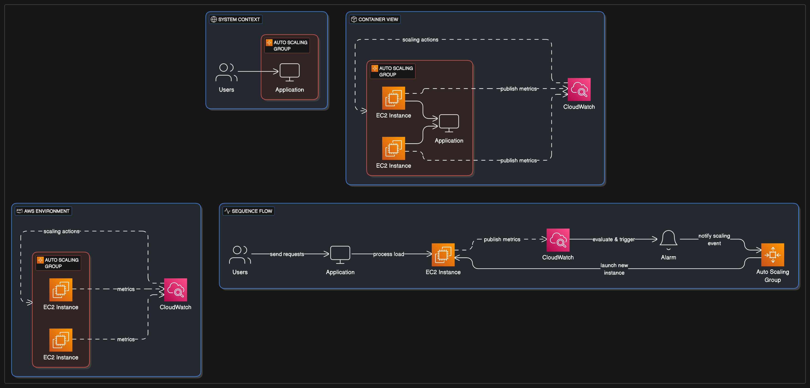

# Dynamic EC2 Scaling with Auto Scaling & CloudWatch
## Project Overview:
This project demonstrates how to implement dynamic scaling for Amazon EC2 instances using AWS Auto Scaling and custom metrics published to Amazon CloudWatch. This architecture ensures that application compute capacity automatically adjusts to fluctuating demand, optimizing performance, user experience, and cost efficiency.

## Problem Statement:
Platforms like Hotstar or Amazon.com experience highly variable user traffic. Manually adding or removing servers (EC2 instances) to handle these fluctuations is inefficient, prone to errors, and costly due to over-provisioning during slack times or under-provisioning during peak loads, leading to poor customer satisfaction. On-premise solutions lack the elasticity to respond dynamically to demand.

The challenge is to automate the scaling of EC2 instances based on real-time application load, specifically using a custom metric like "number of users logged in" to ensure a jitter-free experience for customers and optimize resource utilization.

## Architectural Solution:
The solution leverages AWS's core compute, monitoring, and scaling services to create an elastic and responsive infrastructure:

### EC2 Instances: 

These are the virtual servers that host the application.

### CloudWatch Custom Metric:

A Python script (user_login_simulator.py) running on each EC2 instance simulates user activity and periodically publishes a custom metric (e.g., UsersLoggedIn) to Amazon CloudWatch.

Amazon CloudWatch collects and monitors these metrics, providing visibility into the application's load.

### CloudWatch Alarms:

CloudWatch Alarms are configured to monitor the UsersLoggedIn custom metric.

When the metric crosses predefined thresholds (e.g., too many users or very few users), these alarms are triggered.

### Auto Scaling Group (ASG):

An AWS Auto Scaling Group (ASG) manages a collection of EC2 instances. It ensures that a specified number of instances are running and automatically replaces unhealthy instances.

The ASG uses a Launch Template to define how new EC2 instances should be configured (e.g., AMI, instance type, security groups, and user data for automated software installation and metric publishing).

### Auto Scaling Policies:

Scaling Policies are attached to the ASG and linked to the CloudWatch Alarms.

When a "scale-out" alarm (e.g., UsersLoggedIn is high) is triggered, the policy instructs the ASG to launch more EC2 instances.

When a "scale-in" alarm (e.g., UsersLoggedIn is low) is triggered, the policy instructs the ASG to terminate instances.

### IAM Roles:

AWS Identity and Access Management (IAM) roles are configured to grant the EC2 instances permission to publish custom metrics to CloudWatch.

Additional IAM roles are used by the Auto Scaling service to launch and terminate EC2 instances.

## Automated Deployment (AWS Serverless Application Model - SAM):

The entire infrastructure (EC2 Launch Template, Auto Scaling Group, CloudWatch Alarms, Auto Scaling Policies, and necessary IAM roles) is defined and deployed using an AWS SAM template (template.yaml). This ensures consistent, repeatable, and version-controlled deployments.

### Key Architectural Decisions (KADs):

**Auto Scaling for Elasticity:** Chosen to automatically adjust compute capacity based on demand, ensuring optimal performance and cost efficiency.

**CloudWatch Custom Metrics:** Utilized to provide application-specific load indicators (e.g., UsersLoggedIn), enabling fine-grained control over scaling behavior that standard metrics might not offer.

**Launch Templates with User Data:** Employed to automate the bootstrapping process of new EC2 instances, including installing necessary software and starting the metric publishing script.

**Target Tracking Scaling Policies (Conceptual):** While the example uses simple step scaling for clarity, target tracking policies are a common, more advanced choice for maintaining a specific metric average.

**AWS SAM for Infrastructure as Code:** Utilized to define the entire scaling stack declaratively, enabling automated deployments and versioning of the infrastructure.

## Architecture Diagram

## Code Examples:

Illustrative code snippets for simulating user logins and pushing metrics, and the AWS SAM template for infrastructure provisioning, are provided in their respective folders:

application-scripts/: Python script for user_login_simulator.py.

infrastructure/: AWS SAM template (template.yaml) for deploying the Auto Scaling setup.

## Outcomes & Benefits:

This project successfully demonstrates a dynamic and highly responsive EC2 scaling solution on AWS, providing:

Optimized Performance: Ensures adequate compute resources are always available to handle current demand, leading to a smooth user experience.

**Cost Efficiency:** Automatically scales down during low demand, preventing wastage of CAPEX on under-utilized resources.

**Increased Reliability:** Automatically replaces unhealthy instances, maintaining application availability.

**Reduced Manual Effort:** Eliminates the need for manual intervention in scaling operations.

**Business Agility:** Allows businesses to respond quickly to market changes and unexpected traffic spikes.

This solution is fundamental for any organization building scalable and resilient applications on the AWS Cloud.

## Prerequisites:

### Before you begin, ensure you have the following:

**AWS Account:** An active AWS account with administrative access.

**AWS CLI Configured:** The AWS Command Line Interface (CLI) installed and configured with credentials that have sufficient permissions to deploy CloudFormation stacks, EC2 instances, Auto Scaling Groups, and CloudWatch resources.

**Install AWS CLI:** https://docs.aws.amazon.com/cli/latest/userguide/getting-started-install.html

**Configure AWS CLI:** aws configure

**AWS SAM CLI Installed:** The AWS Serverless Application Model (SAM) CLI installed.

**Install SAM CLI:** https://docs.aws.amazon.com/serverless-application-model/latest/developerguide/serverless-sam-cli-install.html

**Python 3.x:** Installed on your local machine to run the user_login_simulator.py script.

**EC2 Key Pair:** An existing EC2 Key Pair in your desired AWS region. This is essential for SSH access to your EC2 instances if you need to debug or manually inspect them.

**Create a Key Pair:** https://docs.aws.amazon.com/AWSEC2/latest/UserGuide/ec2-key-pairs.html

**VPC with Public Subnets:** A Virtual Private Cloud (VPC) in your AWS account with at least two public subnets across different Availability Zones. The Auto Scaling Group needs these subnets to launch instances.

### Step 1: Clone the Repository
First, clone this GitHub repository to your local machine:

git clone https://github.com/iamkjn/iamkjn.git Or your specific portfolio repo URL
cd iamkjn/projects/Dynamic-EC2-Scaling/

### Step 2: Review and Update template.yaml Parameters
Open the infrastructure/template.yaml file and review the Parameters section. You must update the Default values for the following parameters to match your AWS environment:

**WindowsServer2022AmiId:**

Purpose: The AMI ID for the Windows Server 2022 Base that your EC2 instances will use.

Action: Find a suitable Windows Server 2022 AMI ID for your chosen AWS region. You can search in the EC2 Console under "AMIs" or use the AWS CLI:

aws ec2 describe-images --owners amazon --filters "Name=name,Values=Windows_Server-2022-R2_RTM-English-64Bit-Base*" --query "Images[*].[ImageId,CreationDate]" --region YOUR_AWS_REGION --output text

Update: Replace the Default value in template.yaml with your selected AMI ID.

**KeyPairName:**

Purpose: The name of an existing EC2 Key Pair in your AWS account.

Action: Ensure you have an EC2 Key Pair created in the region you plan to deploy to.

Update: Replace your-ec2-key-pair with your actual Key Pair name.

**AlarmNotificationEmail:**

Purpose: The email address that will receive notifications from the CloudWatch alarm.

Action: Provide an email address you have access to.

Update: Replace HCMonitor@HeavenClassics.com with your actual email.

**VpcId:**

Purpose: The ID of the VPC where your resources will be deployed.

Action: Get your VPC ID from the AWS VPC Console.

Update: Replace vpc-0abcdef1234567890 with your actual VPC ID.

PublicSubnet1Id, PublicSubnet2Id:

Purpose: The IDs of two public subnets in different Availability Zones within your VpcId.

Action: Get these from the AWS VPC Console.

Update: Replace the placeholder subnet IDs with your actual public subnet IDs.

### Step 3: Deploy the AWS Resources using SAM CLI
Navigate to the infrastructure/ directory in your terminal:

cd infrastructure/

**Build the SAM application:**
This command prepares your template and any associated Lambda code (though this project doesn't have custom Lambda code, it's a standard SAM step).

sam build

**Deploy the SAM stack:**
The --guided flag will walk you through the deployment process, prompting for parameters and confirming changes.

sam deploy --guided

**Stack Name:** Choose a unique name for your CloudFormation stack (e.g., DynamicEC2ScalingStack).

**AWS Region:** Select the AWS region where you want to deploy (e.g., us-east-1, eu-west-2). This must match the region of your chosen AMI and Key Pair.

**Parameters:** Confirm the parameters you updated in template.yaml or provide them if prompted.

Confirm changes before deploy: Type y to review the changes.

Deploy this changeset?: Type y to proceed with the deployment.

The deployment may take several minutes as AWS provisions the EC2 instance, security groups, CloudWatch alarms, and SNS topic.

### Step 4: Confirm SNS Subscription
After sam deploy completes, AWS SNS will send a subscription confirmation email to the AlarmNotificationEmail you specified.

Check your inbox for an email from "AWS Notifications" with the subject "AWS Notification - Subscription Confirmation".

Open the email and click the "Confirm subscription" link.

**IMPORTANT:** The CloudWatch alarm will not send email notifications until this subscription is confirmed.

### Step 5: Observe EC2 Instance and CloudWatch Metrics

**Verify EC2 Instance:**

Go to the AWS EC2 Console.

You should see an EC2 instance named HeavenClassicsWindowsServer running.

It may take a few minutes for the instance to fully initialize and for the user_login_simulator.py script (embedded in the UserData) to start running.

**Monitor CloudWatch Metrics:**

Go to the AWS CloudWatch Console.

In the navigation pane, choose Metrics -> All metrics.

Look for the custom namespace NetworkApp.

Click on NetworkApp and then select the UsersLoggedIn metric.

You should start seeing data points appearing on the graph, representing the simulated user logins.

### Step 6: Trigger Auto Scaling (Simulated)
The user_login_simulator.py script running on the EC2 instance will automatically fluctuate the UsersLoggedIn metric.

**Scale Out:** The ScaleOutAlarm is configured to trigger if UsersLoggedIn goes >= 20 for 1 minute (1 period of 60 seconds). When this happens, the ScaleOutPolicy will add 1 instance to the Auto Scaling Group.

**Scale In:** The ScaleInAlarm is configured to trigger if UsersLoggedIn goes <= 10 for 1 minute (1 period of 60 seconds). When this happens, the ScaleInPolicy will remove 1 instance from the Auto Scaling Group.

Observe Auto Scaling Group Activity:

Go to the AWS EC2 Console.

In the navigation pane, choose Auto Scaling Groups.

Select the DynamicScalingASG.

Go to the Activity tab. You will see events like "Launching a new EC2 instance" or "Terminating an EC2 instance" as the alarms are triggered by the simulated metric.

**Observe CloudWatch Alarm State:**

Go to the AWS CloudWatch Console.

In the navigation pane, choose Alarms.

You will see the HighUsersLoggedInAlarm and LowUsersLoggedInAlarm. Observe their state change from OK to ALARM and back to OK as the UsersLoggedIn metric fluctuates.

**Check Email Notifications:**

You should receive email notifications from AWS when the LowCPUUtilizationAlarm (or the HighUsersLoggedInAlarm if you modify its threshold for testing) changes to the ALARM state.

### Step 7: Clean Up Your AWS Resources
To avoid incurring unnecessary AWS charges, it's crucial to clean up all resources after you are done experimenting.

**Delete the SAM Stack:**
Navigate back to the infrastructure/ directory in your terminal:

cd infrastructure/
sam delete --stack-name DynamicEC2ScalingStack # Use the stack name you chose during deployment

Confirm the deletion when prompted. This command will remove all resources created by the SAM template (EC2 instances, ASG, Launch Template, Security Groups, CloudWatch Alarms, SNS Topic, IAM roles).

**Manually Delete SNS Subscription (if sam delete fails):**
Sometimes, the SNS subscription might not be automatically deleted.

Go to the AWS SNS Console.

Select the HeavenClassics-EC2-Monitoring-Alerts-<region> topic.

Go to the Subscriptions tab, select your email subscription, and click Delete.

**Manually Delete CloudWatch Alarm (if sam delete fails):**

Go to the AWS CloudWatch Console.

Choose Alarms, select the alarms, and click Delete.

**Manually Delete IAM User and Group (if sam delete fails):**

Go to the AWS IAM Console.

Go to Users, select HeavenClassicsAdminUser, and click Delete user.

Go to Groups, select AdministratorGroup, and click Delete group.

**Manually Delete EC2 Key Pair (Optional):**

If you created a new Key Pair specifically for this project and no longer need it, go to the EC2 Console -> Key Pairs, select it, and delete it.

By following these steps, you can effectively demonstrate your understanding of dynamic EC2 scaling, CloudWatch monitoring, and IAM management on AWS.

