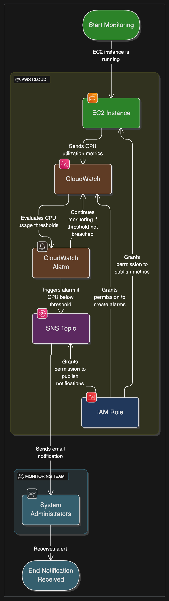

# EC2 Monitoring & IAM Access Management

## Project Overview:

This project demonstrates critical operational aspects of managing an AWS environment: proactive monitoring of EC2 instance health using CloudWatch alarms and securely managing access to AWS resources through IAM Groups and Users. It provides a foundational setup for maintaining system performance and adhering to the principle of least privilege.

## Problem Statement:

In a production environment like Heaven Classics, ensuring the optimal performance and availability of compute instances (EC2) is paramount. Manual monitoring is inefficient and reactive. Furthermore, providing appropriate access to AWS resources for different employees is crucial for security and operational efficiency. Heaven Classics needs an automated way to monitor their Windows 2022 Server EC2 instance's CPU utilization and receive immediate alerts for potential issues, while also establishing a secure user access framework.

## Architectural Solution:

The solution leverages AWS's core compute, monitoring, and identity management services:

### EC2 Instance (Windows Server 2022):

An Amazon EC2 instance is launched, configured with a Windows Server 2022 AMI. This instance represents a critical application server.

Detailed Monitoring is enabled for this EC2 instance, which sends CPU utilization data (and other standard metrics) to CloudWatch at 1-minute intervals.

### CloudWatch Alarm for CPU Utilization:

Amazon CloudWatch automatically collects standard metrics from the EC2 instance, including CPUUtilization.

A CloudWatch Alarm is configured to monitor the CPUUtilization metric.

This alarm is set to trigger if the average CPU utilization for the EC2 instance falls below a specified threshold (e.g., 3%) for a consecutive period (e.g., three consecutive 5-minute periods).

When the alarm state changes to ALARM (low CPU), it sends a notification.

### SNS Topic for Notifications:

An Amazon Simple Notification Service (SNS) Topic is created to act as a central notification channel.

The CloudWatch Alarm is configured to publish messages to this SNS Topic when it enters the ALARM state.

An email subscription is set up for the SNS Topic, ensuring that HCMonitor@HeavenClassics.com receives an email notification when the CPU utilization drops.

### IAM Group (Administrator Group):

AWS Identity and Access Management (IAM) is used to define fine-grained access control.

An IAM Group named Administrator Group is created.

The AWS managed policy AdministratorAccess is attached to this group, granting its members full administrative permissions across the AWS account.

### IAM User:

An IAM User is created for an employee (e.g., heavenclassics-admin-user).

This user is then added to the Administrator Group, inheriting all permissions granted to that group.

### Automated Deployment (AWS Serverless Application Model - SAM):

The entire infrastructure (EC2 Instance, CloudWatch Alarm, SNS Topic, IAM Group, and IAM User) is defined and deployed using an AWS SAM template (template.yaml). This ensures consistent, repeatable, and version-controlled deployments.

### Key Architectural Decisions (KADs):
AWS CloudWatch for Monitoring: Chosen as the native AWS monitoring solution due to its seamless integration with EC2, ability to collect standard and custom metrics, and robust alarming capabilities.

SNS for Notifications: Utilized as a flexible and scalable messaging service to deliver alarm notifications via email, allowing for easy integration with various subscription endpoints in the future.

IAM Groups for Permission Management: Implemented to simplify permission management. Instead of attaching policies directly to individual users, users are added to groups, and permissions are managed at the group level, promoting consistency and reducing administrative overhead.

Managed AdministratorAccess Policy: Used for the Administrator Group to quickly grant comprehensive access, suitable for a core administrative role. In a real-world scenario, custom policies with more granular permissions would be preferred for specific roles to adhere to the principle of least privilege.

Infrastructure as Code (AWS SAM): All resources are defined in template.yaml to ensure automated, repeatable deployments, version control, and traceability of infrastructure changes.

## Diagrams:

## Outcomes & Benefits:
This project successfully demonstrates the implementation of a foundational AWS operational setup, providing:

**Proactive Monitoring:** Ensures critical infrastructure issues (like low CPU utilization indicating an idle or hung server) are detected and alerted immediately, preventing service disruptions.

**Centralized Notification:** Provides a unified channel for alerts, making it easy to manage and distribute notifications.

**Secure Access Management:** Establishes a clear and manageable structure for controlling access to the AWS account, enhancing security posture.

**Operational Efficiency:** Automates monitoring and user provisioning, reducing manual effort and potential for human error.

**Compliance Readiness:** Lays the groundwork for auditing and compliance by defining user permissions systematically.

This solution is crucial for any organization aiming to maintain a healthy, secure, and well-managed AWS environment.

## How to Use This Project: A Step-by-Step Guide

This guide will walk you through setting up and demonstrating the Dynamic EC2 Scaling project on your AWS account.

### Prerequisites:

Before you begin, ensure you have the following:

**AWS Account:** An active AWS account with administrative access.

**AWS CLI Configured:** The AWS Command Line Interface (CLI) installed and configured with credentials that have sufficient permissions to deploy CloudFormation stacks, EC2 instances, Auto Scaling Groups, and CloudWatch resources.

**Install AWS CLI:** https://docs.aws.amazon.com/cli/latest/userguide/getting-started-install.html

**Configure AWS CLI:** aws configure

**AWS SAM CLI Installed:** The AWS Serverless Application Model (SAM) CLI installed.

**Install SAM CLI:** https://docs.aws.amazon.com/serverless-application-model/latest/developerguide/serverless-sam-cli-install.html

**Python 3.x:** Installed on your local machine to run the user_login_simulator.py script.

**EC2 Key Pair:** An existing EC2 Key Pair in your desired AWS region. This is essential for SSH access to your EC2 instances if you need to debug or manually inspect them.

**Create a Key Pair:** https://docs.aws.amazon.com/AWSEC2/latest/UserGuide/ec2-key-pairs.html

**VPC with Public Subnets:** A Virtual Private Cloud (VPC) in your AWS account with at least two public subnets across different Availability Zones. The Auto Scaling Group needs these subnets to launch instances.

### Step 1: Clone the Repository

First, clone this GitHub repository to your local machine:

git clone https://github.com/iamkjn/iamkjn.git # Or your specific portfolio repo URL
cd iamkjn/projects/Dynamic-EC2-Scaling/

### Step 2: Review and Update template.yaml Parameters

Open the infrastructure/template.yaml file and review the Parameters section. You must update the Default values for the following parameters to match your AWS environment:

**WindowsServer2022AmiId:**

Purpose: The AMI ID for the Windows Server 2022 Base that your EC2 instances will use.

Action: Find a suitable Windows Server 2022 AMI ID for your chosen AWS region. You can search in the EC2 Console under "AMIs" or use the AWS CLI:

aws ec2 describe-images --owners amazon --filters "Name=name,Values=Windows_Server-2022_RTM-English-64Bit-Base*" --query "Images[*].[ImageId,CreationDate]" --region YOUR_AWS_REGION --output text

Update: Replace the Default value in template.yaml with your selected AMI ID.

**KeyPairName:**

Purpose: The name of an existing EC2 Key Pair in your AWS account.

Action: Ensure you have an EC2 Key Pair created in the region you plan to deploy to.

Update: Replace your-ec2-key-pair with your actual Key Pair name.

**AlarmNotificationEmail:**

Purpose: The email address that will receive notifications from the CloudWatch alarm.

Action: Provide an email address you have access to.

Update: Replace HCMonitor@HeavenClassics.com with your actual email.

**VpcId:**

Purpose: The ID of the VPC where your resources will be deployed.

Action: Get your VPC ID from the AWS VPC Console.

Update: Replace vpc-0abcdef1234567890 with your actual VPC ID.

PublicSubnet1Id, PublicSubnet2Id:

Purpose: The IDs of two public subnets in different Availability Zones within your VpcId.

Action: Get these from the AWS VPC Console.

Update: Replace the placeholder subnet IDs with your actual public subnet IDs.

### Step 3: Deploy the AWS Resources using SAM CLI

Navigate to the infrastructure/ directory in your terminal:

cd infrastructure/

**Build the SAM application:**
This command prepares your template and any associated Lambda code (though this project doesn't have custom Lambda code, it's a standard SAM step).

sam build

**Deploy the SAM stack:**
The --guided flag will walk you through the deployment process, prompting for parameters and confirming changes.

sam deploy --guided

**Stack Name:** Choose a unique name for your CloudFormation stack (e.g., DynamicEC2ScalingStack).

**AWS Region:** Select the AWS region where you want to deploy (e.g., us-east-1, eu-west-2). This must match the region of your chosen AMI and Key Pair.

**Parameters:** Confirm the parameters you updated in template.yaml or provide them if prompted.

Confirm changes before deploy: Type y to review the changes.

Deploy this changeset?: Type y to proceed with the deployment.

The deployment may take several minutes as AWS provisions the EC2 instance, security groups, CloudWatch alarms, and SNS topic.

### Step 4: Confirm SNS Subscription

After sam deploy completes, AWS SNS will send a subscription confirmation email to the AlarmNotificationEmail you specified.

Check your inbox for an email from "AWS Notifications" with the subject "AWS Notification - Subscription Confirmation".

Open the email and click the "Confirm subscription" link.

IMPORTANT: The CloudWatch alarm will not send email notifications until this subscription is confirmed.

### Step 5: Observe EC2 Instance and CloudWatch Metrics
Verify EC2 Instance:

Go to the AWS EC2 Console.

You should see an EC2 instance named HeavenClassicsWindowsServer running.

It may take a few minutes for the instance to fully initialize and for the user_login_simulator.py script (embedded in the UserData) to start running.

**Monitor CloudWatch Metrics:**

Go to the AWS CloudWatch Console.

In the navigation pane, choose Metrics -> All metrics.

Look for the custom namespace Telemax/NetworkApp.

Click on Telemax/NetworkApp and then select the UsersLoggedIn metric.

You should start seeing data points appearing on the graph, representing the simulated user logins.

### Step 6: Trigger Auto Scaling (Simulated)

The user_login_simulator.py script running on the EC2 instance will automatically fluctuate the UsersLoggedIn metric.

**Scale Out:** The ScaleOutAlarm is configured to trigger if UsersLoggedIn goes >= 20 for 1 minute (1 period of 60 seconds). When this happens, the ScaleOutPolicy will add 1 instance to the Auto Scaling Group.

**Scale In:** The ScaleInAlarm is configured to trigger if UsersLoggedIn goes <= 10 for 1 minute (1 period of 60 seconds). When this happens, the ScaleInPolicy will remove 1 instance from the Auto Scaling Group.

**Observe Auto Scaling Group Activity:**

Go to the AWS EC2 Console.

In the navigation pane, choose Auto Scaling Groups.

Select the DynamicScalingASG.

Go to the Activity tab. You will see events like "Launching a new EC2 instance" or "Terminating an EC2 instance" as the alarms are triggered by the simulated metric.

**Observe CloudWatch Alarm State:**

Go to the AWS CloudWatch Console.

In the navigation pane, choose Alarms.

You will see the HighUsersLoggedInAlarm and LowUsersLoggedInAlarm. Observe their state change from OK to ALARM and back to OK as the UsersLoggedIn metric fluctuates.

**Check Email Notifications:**

You should receive email notifications from AWS when the LowCPUUtilizationAlarm (or the HighUsersLoggedInAlarm if you modify its threshold for testing) changes to the ALARM state.

### Step 7: Clean Up Your AWS Resources
To avoid incurring unnecessary AWS charges, it's crucial to clean up all resources after you are done experimenting.

**Delete the SAM Stack:**
Navigate back to the infrastructure/ directory in your terminal:

cd infrastructure/
sam delete --stack-name DynamicEC2ScalingStack # Use the stack name you chose during deployment

Confirm the deletion when prompted. This command will remove all resources created by the SAM template (EC2 instances, ASG, Launch Template, Security Groups, CloudWatch Alarms, SNS Topic, IAM roles).

Manually Delete SNS Subscription (if sam delete fails):
Sometimes, the SNS subscription might not be automatically deleted.

Go to the AWS SNS Console.

Select the HeavenClassics-EC2-Monitoring-Alerts-<region> topic.

Go to the Subscriptions tab, select your email subscription, and click Delete.

Manually Delete CloudWatch Alarm (if sam delete fails):

Go to the AWS CloudWatch Console.

Choose Alarms, select the alarms, and click Delete.

Manually Delete IAM User and Group (if sam delete fails):

Go to the AWS IAM Console.

Go to Users, select HeavenClassicsAdminUser, and click Delete user.

Go to Groups, select AdministratorGroup, and click Delete group.

**Manually Delete EC2 Key Pair (Optional):**

If you created a new Key Pair specifically for this project and no longer need it, go to the EC2 Console -> Key Pairs, select it, and delete it.

By following these steps, you can effectively demonstrate your understanding of dynamic EC2 scaling, CloudWatch monitoring, and IAM management on AWS.
