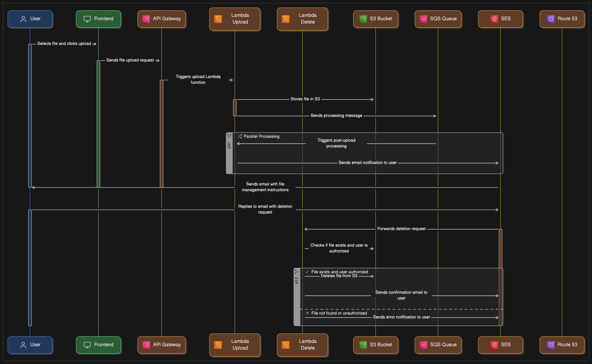

# Automated File Processing & Email Notification System

## Project Overview:

This project implements an end-to-end serverless workflow on AWS for file uploads, automated processing, email notifications, and file management based on email replies. It demonstrates a robust, event-driven architecture leveraging S3, Lambda, API Gateway, SES, SQS, and Route 53.

## Problem Statement:

In many business scenarios, users need to upload files, receive immediate notification about the upload and its details, and have the flexibility to manage (e.g., delete) these files through a simple, intuitive mechanism like replying to an email. Manually handling file uploads, processing, notifications, and subsequent management can be time-consuming, error-prone, and not scalable. A cloud-native, automated solution is required to streamline this process, ensuring reliability and user convenience.

## Architectural Solution:

The solution orchestrates several AWS serverless and managed services to create a seamless file processing and email automation workflow:

### File Upload (Frontend & API Gateway/Lambda/S3 Presigned URL):

A simple local website (HTML/JavaScript) provides a user interface for selecting and uploading files.

When a user selects a file, the frontend makes a request to an Amazon API Gateway endpoint.

This API Gateway endpoint triggers an AWS Lambda function (upload_url_generator_lambda.py), which securely generates a presigned URL for an Amazon S3 Source Bucket.

The frontend then uses this presigned URL to directly upload the file to the S3 Source Bucket. This method is secure as it avoids exposing AWS credentials client-side.

### File Processing & Email Notification (S3 Event & Lambda/SES):

An S3 Event Notification is configured on the S3 Source Bucket. When a new file is uploaded (ObjectCreated event), it triggers an AWS Lambda function (file_processor_notifier_lambda.py).

This Lambda function processes the uploaded file (e.g., extracts metadata, performs basic validation - though the prototype focuses on notification).

It then uses Amazon Simple Email Service (SES) to send an email notification to the user. The email includes details about the uploaded file and instructions on how to delete it by replying "Delete".

### Email Reply Handling & File Management (Route 53/SES/SQS/Lambda/S3):

Amazon Route 53 is used to manage the domain's DNS records, including MX (Mail Exchange) and TXT (SPF) records to configure SES for inbound email receiving.

Amazon SES Receipt Rules are configured to capture incoming emails to the verified domain (e.g., replies to the notification email).

These receipt rules are set to publish the full email content to an Amazon SQS Queue (EmailReplyQueue).

An AWS Lambda function (email_reply_processor_lambda.py) is configured to consume messages from the SQS EmailReplyQueue.

This Lambda function parses the incoming email content from the SQS message. If it detects the "Delete" keyword in the reply, it identifies the original file (e.g., from a unique identifier embedded in the original notification email's subject or headers).

Finally, it moves the identified file from the S3 Source Bucket to a separate Amazon S3 Deleted Bucket, effectively "deleting" it from the active storage. A confirmation email can also be sent.

## Key Architectural Decisions (KADs):
S3 for Storage: Chosen for highly durable, scalable, and cost-effective object storage for both source and deleted files.

API Gateway + Lambda for Presigned URL: Provides a secure and scalable way for the frontend to obtain temporary upload credentials without exposing AWS access keys.

**S3 Event Notifications:** Enables an event-driven workflow, automatically triggering processing upon file upload.

**AWS Lambda for Serverless Processing:** Utilized for all processing logic (URL generation, file processing, email sending, reply handling, file moving) due to its auto-scaling and pay-per-execution model.

Amazon SES for Email: Chosen for its reliable, scalable, and cost-effective email sending and receiving capabilities, crucial for notifications and reply processing.

**Amazon SQS for Decoupling Email Replies:** Acts as a buffer for incoming email replies, ensuring that the email_reply_processor_lambda can process messages even if it experiences transient issues, preventing data loss.

**Route 53 for DNS & Inbound Mail:** Essential for configuring the domain to receive emails via SES and ensuring proper email deliverability.

## Architecture Diagram

## Code Examples:

Illustrative code snippets for the frontend, backend Lambda functions, and the AWS SAM template for infrastructure provisioning are provided in their respective folders:

**frontend/:** HTML and JavaScript for the file upload website.

**backend/:** Python Lambda functions for URL generation, file processing/notification, and email reply handling/file management.

**infrastructure/:** AWS SAM template (template.yaml) for deploying all AWS resources.

## Outcomes & Benefits:

This project delivers a highly automated and resilient file management system on AWS, providing:

**Streamlined Workflow:** Automates file upload, processing, notification, and deletion, reducing manual effort.

**Enhanced User Experience:** Provides immediate feedback on uploads and a simple mechanism for file management via email.

**Scalability & Reliability:** Leverages serverless services that automatically scale to handle varying loads and ensure data integrity.

**Cost-Effectiveness:** Pay-as-you-go model for all AWS services, optimizing operational costs.

**Loose Coupling:** Event-driven architecture ensures components operate independently, improving system resilience.

This solution is ideal for organizations needing efficient, automated, and user-friendly file lifecycle management in the cloud.

## How to Use This Project: A Step-by-Step Guide
This guide will walk you through setting up and demonstrating the Automated File Processing & Email Notification System on your AWS account.

### Prerequisites:

Before you begin, ensure you have the following:

**AWS Account:** An active AWS account with administrative access.

**AWS CLI Configured:** The AWS Command Line Interface (CLI) installed and configured with credentials that have sufficient permissions to deploy CloudFormation stacks, S3 buckets, Lambda functions, API Gateway, SQS, SES, and Route 53 resources.

**Install AWS CLI:** https://docs.aws.amazon.com/cli/latest/userguide/getting-started-install.html

**Configure AWS CLI:** aws configure

**AWS SAM CLI Installed:** The AWS Serverless Application Model (SAM) CLI installed.

**Install SAM CLI:** https://docs.aws.amazon.com/serverless-application-model/latest/developerguide/serverless-sam-cli-install.html

**Python 3.x:** Installed on your local machine.

**Domain Name:** You must own a domain name (e.g., yourcompany.com) that you can manage DNS records for. This is required for SES email receiving.

**Web Server for Frontend (Optional, for local testing):** A simple local HTTP server (e.g., Python's http.server or Node.js's serve) to host the frontend HTML/JS files.

### Step 1: Clone the Repository:

First, clone this GitHub repository to your local machine:

git clone https://github.com/iamkjn/iamkjn.git # Or your specific portfolio repo URL
cd iamkjn/projects/AWS-File-Processing-Email-Automation/

### Step 2: Review and Update template.yaml Parameters:

Open the infrastructure/template.yaml file and review the Parameters section. You must update the Default values for the following parameters to match your AWS environment and domain:

**DomainName:**

Purpose: Your domain name that will be used for sending and receiving emails via SES (e.g., yourdomain.com).

Action: Replace yourdomain.com with the actual domain name you own.

**SenderEmailAddress:**

Purpose: The email address (e.g., no-reply@yourdomain.com) that will be used by the system to send notifications.

Action: Replace no-reply@yourdomain.com with an actual email address you have access to and want to use as the sender.

**DeletionEmailAddress:**

Purpose: The email address (e.g., delete@yourdomain.com) that will receive "Delete" replies from users.

Action: Replace delete@yourdomain.com with an actual email address you have access to.

### Step 3: Deploy the AWS Resources using SAM CLI

Navigate to the infrastructure/ directory in your terminal:

cd infrastructure/

**Build the SAM application:**

This command packages your Lambda code and prepares the template for deployment.

sam build

**Deploy the SAM stack:**

The --guided flag will walk you through the deployment process, prompting for parameters and confirming changes.

sam deploy --guided

**Stack Name:** Choose a unique name for your CloudFormation stack (e.g., FileProcessingEmailStack).

AWS Region: Select the AWS region where you want to deploy (e.g., eu-west-2).

Parameters: You will be prompted for DomainName, SenderEmailAddress, and DeletionEmailAddress. Provide the values you updated in Step 2.

Confirm changes before deploy: Type y to review the changes.

Deploy this changeset?: Type y to proceed with the deployment.

The deployment may take several minutes as AWS provisions S3 buckets, Lambda functions, API Gateway, SQS, SES identities, and Route 53 hosted zones/records.

### Step 4: Verify SES Identities and Configure DNS
This is a CRUCIAL MANUAL STEP that must be completed after the SAM deployment.

**Verify Email Addresses in SES:**

Go to the AWS SES Console.

Navigate to Verified identities.

You will see your SenderEmailAddress and DeletionEmailAddress listed.

AWS SES will have sent verification emails to these addresses. You MUST open these emails and click the verification links. Emails cannot be sent or received via SES until these are verified.

**Verify Domain in SES and Update DNS:**

In the AWS SES Console, navigate to Verified identities.

Click on your DomainName.

You will see a section for DNS records. AWS provides CNAME records for domain verification and MX and TXT (SPF) records for email sending/receiving.

Important: While the SAM template attempts to create MX and TXT records in Route 53, you MUST ensure your domain's Name Servers (NS records) are pointing to the Route 53 Hosted Zone created by your SAM stack.

Go to the AWS Route 53 Console.

Navigate to Hosted zones.

Find the hosted zone created by your stack (it will have your DomainName).

Copy the Name Servers listed for this hosted zone.

Log into your domain registrar's website (where you purchased your domain) and update your domain's Name Servers to these values. This step delegates DNS management to Route 53.

Once DNS propagation occurs (can take minutes to hours), SES will automatically verify the domain, and inbound/outbound email will function.

Step 5: Update Frontend script.js
After the SAM deployment, you will get the API Gateway endpoint URL for generating presigned URLs.

**Get API Gateway URL:**

From the SAM deployment output in your terminal, copy the UploadUrlApiEndpoint value.

Alternatively, go to the AWS CloudFormation Console, select your stack, go to the Outputs tab, and copy the UploadUrlApiEndpoint value.

**Update script.js:**

Open frontend/script.js in your local project.

Replace 'YOUR_PRESIGNED_URL_API_ENDPOINT_HERE' with the UploadUrlApiEndpoint you copied.

### Step 6: Host the Frontend Locally and Test
Serve the Frontend:
Navigate to the frontend/ directory in your terminal:

cd frontend/

You can use a simple Python HTTP server (if Python is installed):

python3 -m http.server 8000

Or, if you have Node.js installed, you can use npx serve:

npx serve

This will start a local web server, usually at http://localhost:8000.

**Open in Browser:**
Open your web browser and navigate to the address provided by your local server (e.g., http://localhost:8000).

**Test the Workflow:**

On the website, select a file to upload and enter the SenderEmailAddress (or any email address you control that is verified in SES for sending).

Click "Upload File."

**Verify Upload Notification:** Check the inbox of the email address you provided. You should receive an email confirming the file upload. Note the "ID:..." in the subject line.

**Test Deletion:** Reply to that notification email from the same email address you received it on. In the subject or body of your reply, type the word "Delete" (case-insensitive).

**Verify File Movement:** Go to your AWS S3 Console. Check the SourceFilesBucket – the file should be gone. Check the DeletedFilesBucket – the file should now be present there. You should also receive a confirmation email about the deletion.

### Step 7: Clean Up Your AWS Resources
To avoid incurring unnecessary AWS charges, it's crucial to clean up all resources after you are done experimenting.

**Delete the SAM Stack:**
Navigate back to the infrastructure/ directory in your terminal:

cd infrastructure/
sam delete --stack-name FileProcessingEmailStack # Use the stack name you chose during deployment

Confirm the deletion when prompted. This command will remove all resources created by the SAM template (S3 buckets, Lambda functions, API Gateway, SQS queue, SES identities, Route 53 hosted zone/records, SNS topic).

**Manually Delete SES Identities (if sam delete fails):**

Go to the AWS SES Console -> Verified identities.

Select your email addresses and domain, and click Delete.

Manually Delete S3 Buckets (if sam delete fails or if they contain objects):

Go to the AWS S3 Console.

Select SourceFilesBucket and DeletedFilesBucket.

You may need to empty the buckets first if they contain objects (including raw-emails/ prefix) before you can delete them.

Click Delete.

By following these steps, you can effectively demonstrate your understanding of automated file processing, email notifications, and serverless architecture on AWS.
