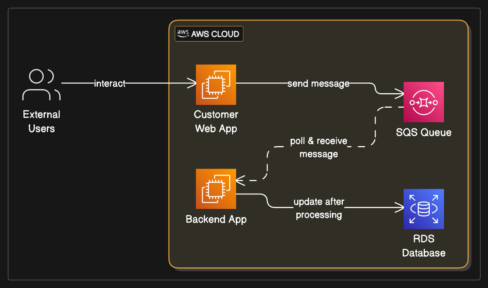

# Loosely Coupled Architecture with AWS SQS

## Project Overview:

This project demonstrates the implementation of a loosely coupled architecture pattern using Amazon Simple Queue Service (SQS) on AWS. It illustrates how SQS can act as a buffer between interacting applications, enhancing system resilience, scalability, and fault tolerance by preventing direct dependencies.

## Problem Statement:

In traditional application designs, direct communication between services leads to a "tightly coupled" architecture. If one application experiences downtime, it can directly impact other dependent applications, potentially leading to data loss or cascading system failures. Organizations need a robust mechanism to ensure continuous operation and data integrity even when individual components face issues.

## Real-World Scenario:

Building on the TELEMAX scenario, imagine their network management system has various components: a "Customer Web Application" for user interactions (e.g., configuring devices, viewing network status) and a "Backend Application" responsible for processing these configurations and updating a central database (e.g., in Amazon RDS). If the Backend Application is temporarily unavailable (e.g., during maintenance, scaling events, or unexpected failures), the Customer Web Application would typically fail to process user requests, leading to a poor user experience and potential loss of critical configuration data.

## Architectural Solution:

The solution introduces Amazon SQS as an intermediary message queue to decouple the Customer Web Application from the Backend Application.

## Customer Web Application (Message Producer - Simulated):

This application (simulated by customer_web_app_sender.py) generates user requests or configuration updates.

Instead of directly calling the Backend Application, it sends these messages to an Amazon SQS Standard Queue.

The Customer Web Application can continue to operate and send messages to the SQS queue even if the Backend Application is down, as SQS buffers the messages.

## Amazon SQS Standard Queue:

Amazon SQS provides a fully managed message queuing service. It reliably stores messages, ensuring they are not lost even if consuming applications are unavailable.

It acts as a buffer, decoupling the sender (Customer Web Application) from the receiver (Backend Application), allowing them to operate independently and asynchronously.

## Backend Application (Message Consumer - Simulated):

This application (simulated by backend_app_poller.py) continuously polls the SQS queue for new messages.

When messages are available, it retrieves and processes them (e.g., updating a database like Amazon RDS).

If the Backend Application goes down, messages remain safely in the SQS queue and are processed once the application recovers.

## Database (Amazon RDS - Conceptual):

After processing messages from SQS, the Backend Application would update a relational database, such as Amazon RDS, which provides a managed relational database service. (The prototype focuses on the SQS interaction, with RDS as the conceptual final destination).

## Automated Deployment (AWS Serverless Application Model - SAM):

The core AWS resource for this architecture, the SQS Queue, along with necessary IAM roles for message sending/receiving, is defined and deployed using an AWS SAM template (template.yaml). This ensures consistent, repeatable, and version-controlled infrastructure provisioning.

## Key Architectural Decisions (KADs):

AWS SQS for Decoupling: Chosen as the central message queue to eliminate direct dependencies between applications, ensuring fault tolerance and asynchronous communication.

SQS Standard Queue: Selected for its high throughput and at-least-once delivery guarantee, suitable for most general-purpose decoupling scenarios.

Producer-Consumer Pattern: Implemented to allow applications to operate independently, improving overall system resilience and scalability.

AWS SAM for Infrastructure as Code: Utilized to define and deploy the SQS queue and related IAM resources, promoting automation and maintainability.

EC2 for Application Hosting (Conceptual): Acknowledged as a typical environment for hosting the producer/consumer applications, allowing for flexible compute choices.

RDS for Persistent Storage (Conceptual): Included as the target database for processed messages, highlighting the full data flow in a real-world scenario.

## Architecture Diagram

## Code Examples:

Illustrative code snippets for simulating the message sending and polling applications, and the AWS SAM template for infrastructure provisioning, are provided in their respective folders:

application-simulators/: Python scripts for customer_web_app_sender.py and backend_app_poller.py.

infrastructure/: AWS SAM template (template.yaml) for deploying the SQS queue and IAM roles.

## Outcomes & Benefits:

This project successfully demonstrates the power of message queuing in building resilient and scalable distributed systems on AWS, providing:

Loose Coupling: Applications operate independently, reducing inter-dependencies and preventing cascading failures.

Increased Resilience & Fault Tolerance: Messages are buffered in SQS, ensuring no data loss even if consuming applications are temporarily unavailable.

Scalability: Both producer and consumer applications can scale independently based on message volume, without directly impacting each other.

Asynchronous Communication: Enables non-blocking operations, improving overall system responsiveness.

Reduced Operational Burden: Managed SQS service minimizes the need for manual queue management.

This solution is crucial for organizations aiming to build robust, highly available, and flexible application architectures in the cloud.

## How to Use This Project: 

A Step-by-Step Guide
This guide will walk you through setting up and demonstrating the Loosely Coupled Architecture with AWS SQS on your AWS account.

## Prerequisites:

Before you begin, ensure you have the following:

**AWS Account:** An active AWS account with administrative access.

**AWS CLI Configured:** The AWS Command Line Interface (CLI) installed and configured with credentials that have sufficient permissions to deploy CloudFormation stacks, SQS queues, and IAM roles.

**Install AWS CLI:** https://docs.aws.amazon.com/cli/latest/userguide/getting-started-install.html

**Configure AWS CLI:** aws configure

**AWS SAM CLI Installed:** The AWS Serverless Application Model (SAM) CLI installed.

**Install SAM CLI:** https://docs.aws.amazon.com/serverless-application-model/latest/developerguide/serverless-sam-cli-install.html

**Python 3.x:** Installed on your local machine to run the simulator scripts.

**Conceptual RDS Instance (Optional):** While the project simulates RDS interaction, if you wish to fully test the backend_app_poller.py with a real database, you would need an AWS Aurora Serverless v1 or v2 instance configured with the Data API enabled.

**Step 1:** Clone the Repository
First, clone this GitHub repository to your local machine:

git clone https://github.com/iamkjn/iamkjn.git # Or your specific portfolio repo URL
cd iamkjn/projects/AWS-Loosely-Coupled-Architecture-SQS/

**Step 2:** Review and Update template.yaml
Open the infrastructure/template.yaml file. There are no parameters to update in this specific template, as the queue name is generated dynamically. However, it's good practice to review the resource definitions.

**Step 3:** Deploy the AWS Resources using SAM CLI
Navigate to the infrastructure/ directory in your terminal:

cd infrastructure/

**Build the SAM application:**

sam build

**Deploy the SAM stack:**

The --guided flag will walk you through the deployment process, prompting for parameters and confirming changes.

sam deploy --guided

**Stack Name:** Choose a unique name for your CloudFormation stack (e.g., SQSDecouplingStack).

**AWS Region:** Select the AWS region where you want to deploy (e.g., eu-west-2).

Confirm changes before deploy: Type y to review the changes.

Deploy this changeset?: Type y to proceed with the deployment.

The deployment may take a few minutes as AWS provisions the SQS queue and IAM roles.

**Step 4:** Get SQS Queue URL
After sam deploy completes, the SAM CLI will output the CustomerRequestQueueUrl. This URL is essential for your simulator scripts.

Copy the CustomerRequestQueueUrl value from the SAM deployment output in your terminal.

Alternatively, go to the AWS CloudFormation Console, select your stack, go to the Outputs tab, and copy the CustomerRequestQueueUrl value.

**Step 5:** Update Simulator Scripts
Open the following files in your local project:

application-simulators/customer_web_app_sender.py

application-simulators/backend_app_poller.py

In both files, replace 'YOUR_SQS_QUEUE_URL_HERE' with the actual CustomerRequestQueueUrl you copied in Step 4.

If you plan to test the RDS Data API integration in backend_app_poller.py:

You will also need to update DB_CLUSTER_ARN, DB_SECRET_ARN, and DATABASE_NAME in backend_app_poller.py with your actual Aurora Serverless details. Without these, the RDS part of the simulation will print warnings and skip database interaction.

**Step 6:** Run the Simulators
Navigate to the application-simulators/ directory in your terminal:

cd application-simulators/

Open two separate terminal windows/tabs.

In the first terminal, run the sender application:

python3 customer_web_app_sender.py

This script will start sending simulated messages to your SQS queue.

In the second terminal, run the backend poller application:

python3 backend_app_poller.py

This script will start polling messages from the SQS queue and simulate processing them.

**Step 7:** Verify in AWS Console
While the simulators are running:

AWS SQS Console: Go to the AWS SQS Console, find your customer-request-queue. You can monitor the "Messages Available" metric to see messages accumulating (if the sender is faster than the poller) and then being consumed.

CloudWatch Logs: Go to the AWS CloudWatch Console -> Log groups. You'll see log groups for your Lambda functions (if you had any, though this project uses direct SQS polling). For the SQS queue, you'll see metrics on message counts.

**Step 8:** Demonstrate Decoupling (Optional)
To showcase the decoupling:

Stop the backend_app_poller.py in its terminal.

Keep the customer_web_app_sender.py running.

Observe in the SQS Console that "Messages Available" starts to increase, as messages are buffered in the queue.

Restart the backend_app_poller.py.

Observe that the backend_app_poller.py starts processing the backlog of messages from the queue, demonstrating that no data was lost while it was down.

**Step 9:** Clean Up Your AWS Resources
To avoid incurring unnecessary AWS charges, it's crucial to clean up all resources after you are done experimenting.

Stop both simulator scripts (Ctrl+C in their respective terminals).

**Delete the SAM Stack:**
Navigate back to the infrastructure/ directory in your terminal:

cd infrastructure/
sam delete --stack-name SQSDecouplingStack # Use the stack name you chose during deployment

Confirm the deletion when prompted. This command will remove all resources created by the SAM template (SQS queue, IAM roles).

Manually Delete SQS Queue (if sam delete fails):

Go to the AWS SQS Console.

Select your customer-request-queue and click Delete.

By following these steps, you can effectively demonstrate your understanding of building loosely coupled architectures using AWS SQS.
