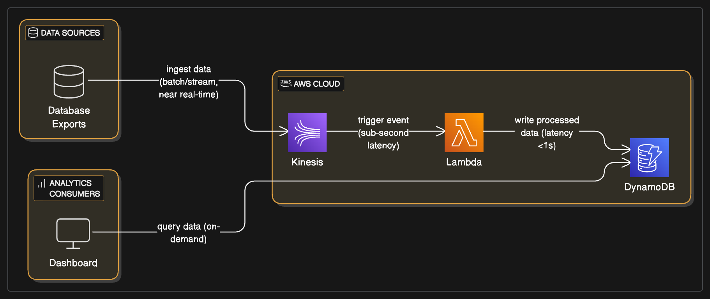

# AWS-Realtime-Data-Pipeline-Kinesis-DynamoDB

## Project Overview:

This project demonstrates a real-time data management solution on the AWS Cloud, designed to ingest streaming data into Amazon Kinesis, process it with AWS Lambda, and store it in Amazon DynamoDB for future analysis. This architecture provides a scalable, flexible, and cost-effective foundation for organizations requiring immediate insights from high-volume data streams.

## Problem Statement:

A company building communication networks in rapidly growing, underserved markets, needs to optimize its network topologies continuously. This requires deploying an effective architecture for NoSQL-based data warehousing built from real-time data generated by their innovative communication hardware. The challenge is to efficiently collect, process, and store this real-time data in a way that is scalable, flexible, and cost-effective, enabling future analytical capabilities.

## Architectural Solution:

The solution leverages key AWS serverless and managed services to create a robust real-time data pipeline:

## Data Generation (Simulated):

A Python script (data_generator.py) simulates the continuous generation of network performance data (e.g., link IDs, speeds, latencies).

This script pushes the simulated data directly into an Amazon Kinesis Data Stream.

## Data Ingestion & Streaming (Amazon Kinesis Data Stream):

Amazon Kinesis Data Stream acts as a highly scalable and durable real-time data ingestion service. It reliably captures and stores gigabytes of data per second from thousands of sources, making it ideal for continuous data feeds from network hardware.

## Real-time Processing (AWS Lambda):

An AWS Lambda function (kinesis_processor_lambda.py) is configured as a consumer of the Kinesis Data Stream.

Lambda automatically scales to process incoming records from the stream. The function extracts relevant data points from each Kinesis record, performs any necessary transformations or validations, and prepares the data for storage.

## Data Warehousing (Amazon DynamoDB):

Amazon DynamoDB, a fully managed, high-performance NoSQL database, serves as the data warehouse for the processed real-time data.

DynamoDB's flexible schema, single-digit millisecond performance at any scale, and serverless nature make it an excellent choice for storing the network topology data, allowing for efficient retrieval and analysis for optimization.

## Automated Deployment (AWS Serverless Application Model - SAM):

The entire backend infrastructure (Kinesis Stream, Lambda Function, DynamoDB Table, and necessary IAM roles) is defined and deployed using an AWS SAM template (template.yaml). This ensures consistent, repeatable, and version-controlled deployments.

## Key Architectural Decisions (KADs):

Kinesis for Real-time Ingestion: Chosen for its ability to handle high-throughput, low-latency data streams, providing a reliable buffer before processing.

Lambda for Stream Processing: Selected for its serverless nature, auto-scaling capabilities, and cost-effectiveness for processing individual records from Kinesis without managing servers.

DynamoDB for NoSQL Data Warehousing: Opted for its managed service benefits, high performance for read/write operations, and flexible schema to accommodate evolving network data structures.

AWS SAM for Infrastructure as Code: Utilized to define the entire serverless application stack declaratively, enabling automated deployments and versioning of the infrastructure.

## Architecture Diagram

## Code Examples:

Illustrative code snippets for simulating data generation, the Kinesis processing Lambda function, and the AWS SAM template for infrastructure provisioning are provided in their respective folders:

data-generator/: Python script to send data to Kinesis.

kinesis-processor-lambda/: Python code for the AWS Lambda function.

infrastructure/: AWS SAM template (template.yaml) for deploying the AWS resources.

## Outcomes & Benefits:

This project successfully demonstrates a robust and efficient real-time data pipeline on AWS, providing:

Scalability: Automatically scales to handle vast amounts of incoming real-time network data.

Cost-Effectiveness: Leverages serverless and managed services, optimizing costs based on actual usage.

Flexibility: Adaptable to various data sources and future analytical requirements for network optimization.

Reduced Operational Burden: Minimizes the need for manual server management and maintenance.

Foundation for Analytics: Provides a structured, real-time data store in DynamoDB, ready for immediate analysis to optimize network topologies.

This solution empowers organizations to make data-driven decisions swiftly, improving their services and operational efficiency.

## How to Use This Project: 

A Step-by-Step Guide
This guide will walk you through setting up and demonstrating the Real-time Data Pipeline for Network Optimization on your AWS account.

### Prerequisites:

Before you begin, ensure you have the following:

**AWS Account:** An active AWS account with administrative access.

**AWS CLI Configured:** The AWS Command Line Interface (CLI) installed and configured with credentials that have sufficient permissions to deploy CloudFormation stacks, Kinesis streams, Lambda functions, and DynamoDB tables.

**Install AWS CLI:** https://docs.aws.amazon.com/cli/latest/userguide/getting-started-install.html

**Configure AWS CLI:** aws configure

**AWS SAM CLI Installed:** The AWS Serverless Application Model (SAM) CLI installed.

**Install SAM CLI:** https://docs.aws.amazon.com/serverless-application-model/latest/developerguide/serverless-sam-cli-install.html

**Python 3.x:** Installed on your local machine to run the data_generator.py script.

**Step 1: Clone the Repository**

First, clone this GitHub repository to your local machine:

git clone https://github.com/iamkjn/iamkjn.git # Or your specific portfolio repo URL
cd iamkjn/projects/AWS-Realtime-Data-Pipeline-Kinesis-DynamoDB/

**Step 2: Review template.yaml**

Open the infrastructure/template.yaml file. There are no parameters to update in this specific template, as resource names are generated dynamically or have fixed defaults. However, it's good practice to review the resource definitions for the Kinesis Stream, Lambda Function, and DynamoDB Table.

**Step 3: Deploy the AWS Resources using SAM CLI**

Navigate to the infrastructure/ directory in your terminal:

cd infrastructure/

**Build the SAM application:**
This command packages your Lambda code and prepares the template for deployment.

sam build

**Deploy the SAM stack:**
The --guided flag will walk you through the deployment process, prompting for parameters and confirming changes.

sam deploy --guided

**Stack Name:** Choose a unique name for your CloudFormation stack (e.g., RealtimeDataStack).

**AWS Region:** Select the AWS region where you want to deploy (e.g., eu-west-2).

Confirm changes before deploy: Type y to review the changes.

Deploy this changeset?: Type y to proceed with the deployment.

The deployment may take several minutes as AWS provisions the Kinesis stream, Lambda function, and DynamoDB table.

**Step 4: Get Kinesis Stream Name**

After sam deploy completes, the SAM CLI will output the KinesisStreamName. This name is essential for your data_generator.py script.

Copy the KinesisStreamName value from the SAM deployment output in your terminal.

Alternatively, go to the AWS CloudFormation Console, select your stack, go to the Outputs tab, and copy the KinesisStreamName value.

**Step 5: Update Data Generator Script**

Open data-generator/data_generator.py in your local project.

Replace "network-data-stream" in KINESIS_STREAM_NAME with the actual KinesisStreamName you copied in Step 4.

**Step 6: Run the Data Generator**

Navigate to the data-generator/ directory in your terminal:

cd ../data-generator/

Run the data generator script:

python3 data_generator.py

This script will start sending simulated network data into your Kinesis stream. You will see messages indicating successful record sends.

**Step 7: Verify Data in DynamoDB**

While the data_generator.py script is running:

Go to the AWS DynamoDB Console.

Navigate to Tables and find the table named network-topology-data.

Click on the table name, then go to the Explore items tab.

You should start seeing new items (records) appearing in the table as the Lambda function processes the data from Kinesis and writes it to DynamoDB. This confirms the end-to-end pipeline is working.

**Step 8: Clean Up Your AWS Resources**

To avoid incurring unnecessary AWS charges, it's crucial to clean up all resources after you are done experimenting.

Stop the data_generator.py script (Ctrl+C in its terminal).

**Delete the SAM Stack:**
Navigate back to the infrastructure/ directory in your terminal:

cd ../infrastructure/
sam delete --stack-name RealtimeDataStack # Use the stack name you chose during deployment

Confirm the deletion when prompted. This command will remove all resources created by the SAM template (Kinesis stream, Lambda function, DynamoDB table, and associated IAM roles).

Manually Delete DynamoDB Table (if sam delete fails):

Go to the AWS DynamoDB Console.

Select the network-topology-data table and click Delete.

Manually Delete Kinesis Stream (if sam delete fails):

Go to the AWS Kinesis Console.

Select the network-data-stream and click Delete.

By following these steps, you can effectively demonstrate your understanding of building real-time data pipelines using AWS Kinesis, Lambda, and DynamoDB.
