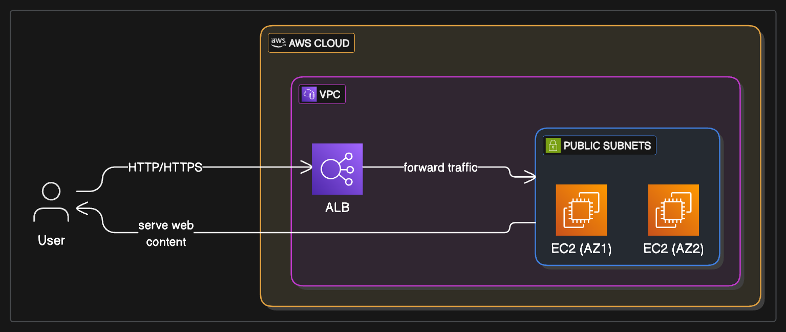

# Web Server Deployment & Load Balancing for Client Website

## Project Overview:

This project demonstrates the end-to-end process of deploying a web server on AWS EC2, configuring a static website, creating a reusable Amazon Machine Image (AMI), and setting up an Application Load Balancer (ALB) to ensure high availability and successful testing of the web application.

## Problem Statement:

A new client requires a web server to host their website entirely on the AWS Cloud. After the initial web server setup, the critical next step is to ensure its high availability, scalability, and successful testing under various conditions. This involves not just launching a single instance, but creating a robust, load-balanced environment capable of handling traffic efficiently and reliably.

## Architectural Solution:

The solution involves a multi-step process to build a resilient web hosting environment:

Initial EC2 Instance Creation (Windows Server 2022):

An Amazon EC2 instance running Windows Server 2022 Base is launched.

User Data (PowerShell Script): A PowerShell script is executed during instance launch to automatically:

Install the IIS (Internet Information Services) web server role.

Create a simple static website (index.html) in the default IIS web root.

This initial instance serves as the "golden image" candidate.

## AMI Creation (Manual Step):

Once the initial EC2 instance is fully configured with IIS and the static website, a custom Amazon Machine Image (AMI) is created from this instance. This AMI captures the entire state of the configured server, including the OS, IIS, and the website content.

This AMI becomes the reusable template for launching identical, pre-configured web servers.

## Application Load Balancer (ALB):

An Application Load Balancer (ALB) is deployed across multiple Availability Zones. The ALB automatically distributes incoming application traffic across multiple targets, such as EC2 instances.

It operates at the application layer (Layer 7) and supports path-based routing, host-based routing, and SSL termination.

## Target Group:

A Target Group is created and associated with the ALB. This group registers the EC2 instances that will serve the web traffic.

Health checks are configured within the Target Group to continuously monitor the health of the registered instances (e.g., checking if IIS is responding on port 80).

## EC2 Instances from AMI (Managed by ASG - Conceptual for simplicity):

For this project, we will directly launch two new EC2 instances using the custom AMI created in step 2. (In a production scenario, these would typically be managed by an Auto Scaling Group for automatic scaling and healing).

These instances are registered with the ALB's Target Group.

## DNS Verification:

The DNS name of the Application Load Balancer is accessed via a web browser. The ALB distributes the request to one of the healthy EC2 instances, serving the static website. This verifies that the entire setup, from load balancer to web server, is functioning correctly.

## Key Architectural Decisions (KADs):

EC2 for Web Server Hosting: Provides full control over the operating system and web server software (IIS in this case).

IIS for Windows Web Server: A native and robust web server for Windows environments.

Custom AMI for Automation: Enables rapid and consistent deployment of pre-configured web servers, reducing manual setup time and ensuring uniformity across instances.

Application Load Balancer (ALB) for High Availability & Scalability: Provides load distribution, fault tolerance across Availability Zones, and improved performance by distributing traffic.

Static Website for Simple Testing: A basic index.html simplifies the verification process, confirming the web server is serving content.

Infrastructure as Code (AWS SAM): All foundational AWS resources (EC2, Security Groups, ALB, Target Group, Listener) are defined in template.yaml for automated, repeatable deployments.

## Architecture Diagram

## Code Examples:

Illustrative code snippets for the static web content and the AWS SAM template for infrastructure provisioning are provided in their respective folders:

web-content/: Simple index.html file.

infrastructure/: AWS SAM template (template.yaml) for deploying the EC2 instance, ALB, and related resources.

## Outcomes & Benefits:

This project successfully demonstrates the deployment and testing of a highly available web server environment on AWS, providing:

High Availability: Traffic is distributed across multiple instances, ensuring the website remains accessible even if one instance fails.

Scalability: The architecture can easily scale horizontally by adding more EC2 instances behind the ALB.

Automated Configuration: User data scripts and AMIs streamline the server setup process.

Efficient Traffic Distribution: The ALB ensures optimal load balancing and health checking of web servers.

Robust Testing Environment: Provides a stable and verifiable setup for client website testing.

This solution is fundamental for hosting web applications that require reliability and performance on the AWS Cloud.

## How to Use This Project: A Step-by-Step Guide

This guide will walk you through setting up and demonstrating the Web Server Deployment & Load Balancing project on your AWS account.

## Prerequisites:

Before you begin, ensure you have the following:

**AWS Account:** An active AWS account with administrative access.

**AWS CLI Configured:** The AWS Command Line Interface (CLI) installed and configured with credentials that have sufficient permissions to deploy CloudFormation stacks, EC2 instances, Application Load Balancers, and related resources.

**Install AWS CLI:** https://docs.aws.amazon.com/cli/latest/userguide/getting-started-install.html

**Configure AWS CLI:** aws configure

**AWS SAM CLI Installed:** The AWS Serverless Application Model (SAM) CLI installed.

**Install SAM CLI:** https://docs.aws.amazon.com/serverless-application-model/latest/developerguide/serverless-sam-cli-install.html

**EC2 Key Pair:** An existing EC2 Key Pair in your desired AWS region. This is essential for RDP access to your Windows EC2 instances.

**Create a Key Pair:** https://docs.aws.amazon.com/AWSEC2/latest/UserGuide/ec2-key-pairs.html

**VPC with Public Subnets:** A Virtual Private Cloud (VPC) in your AWS account with at least two public subnets across different Availability Zones. The ALB and EC2 instances need these subnets.

Web Server for Frontend (Optional, for local testing): A simple local HTTP server (e.g., Python's http.server or Node.js's serve) to host the static index.html if you want to test the local website before deploying to EC2.

**Step 1: Clone the Repository**

First, clone this GitHub repository to your local machine:

git clone https://github.com/iamkjn/iamkjn.git # Or your specific portfolio repo URL
cd iamkjn/projects/AWS-Web-Server-Deployment-Testing/

**Step 2: Review and Update template.yaml Parameters**

Open the infrastructure/template.yaml file and review the Parameters section. You must update the Default values for the following parameters to match your AWS environment:

WindowsServer2022AmiId:

Purpose: The AMI ID for the Windows Server 2022 Base that your EC2 instances will use.

Action: Find a suitable Windows Server 2022 AMI ID for your chosen AWS region. You can search in the EC2 Console under "AMIs" or use the AWS CLI:

aws ec2 describe-images --owners amazon --filters "Name=name,Values=Windows_Server-2022_RTM-English-64Bit-Base*" --query "Images[*].[ImageId,CreationDate]" --region YOUR_AWS_REGION --output text

Update: Replace the Default value in template.yaml with your selected AMI ID.

KeyPairName:

Purpose: The name of an existing EC2 Key Pair in your AWS account.

Action: Ensure you have an EC2 Key Pair created in the region you plan to deploy to.

Update: Replace your-ec2-key-pair with your actual Key Pair name.

VpcId:

Purpose: The ID of the VPC where your resources will be deployed.

Action: Get your VPC ID from the AWS VPC Console.

Update: Replace vpc-0abcdef1234567890 with your actual VPC ID.

PublicSubnet1Id, PublicSubnet2Id:

Purpose: The IDs of two public subnets in different Availability Zones within your VpcId.

Action: Get these from the AWS VPC Console.

Update: Replace the placeholder subnet IDs with your actual public subnet IDs.

**Step 3: Deployment Phase 1 (Initial Server Setup)**

This phase deploys the initial EC2 instance that you will manually configure and create an AMI from.

**Build the SAM application:**

Navigate to the infrastructure/ directory in your terminal:

cd infrastructure/
sam build

**Deploy the SAM stack (Phase 1):**

sam deploy --guided

Stack Name: Choose a unique name for your CloudFormation stack (e.g., WebServerDeploymentStack).

AWS Region: Select the AWS region where you want to deploy (must match the region of your chosen AMI and Key Pair).

Parameters: Confirm the parameters you updated in Step 2.

Confirm changes before deploy: Type y to review the changes.

Deploy this changeset?: Type y to proceed with the deployment.

The deployment will create the InitialWebServerInstance and associated security groups.

**Wait for Initial Instance Configuration:**

After deployment, note the InitialWebServerPublicIp from the SAM outputs.

It typically takes 10-15 minutes for the Windows instance to boot, for IIS to install via UserData, and for the simple index.html to be placed.

You can monitor the instance status in the AWS EC2 Console.

Optional: You can RDP into the instance (using the Public IP and the password obtained from your Key Pair) to verify IIS is running and the index.html is present in C:\inetpub\wwwroot\. You can also try accessing http://<InitialWebServerPublicIp> in your browser to confirm the initial website is served.

**Step 4: Manual AMI Creation (Crucial Step)**

Once the InitialWebServerInstance is fully configured with IIS and your static website, you need to create a custom AMI from it. This AMI will be used to launch identical web servers behind your Load Balancer.

**In the AWS EC2 Console:**

Navigate to Instances.

Select your InitialHeavenClassicsWebServer instance.

Go to Actions -> Image and templates -> Create image.

Image name: Give it a descriptive name (e.g., HeavenClassics-IIS-WebAMI).

Image description: Add a brief description.

Click Create image.

**Wait for AMI Creation:**

Go to AMIs under "Images" in the EC2 console.

Wait for the AMI creation process to complete (its status will change from "pending" to "available"). This can take several minutes.

Note down the AMI ID (e.g., ami-0abcdef1234567890). You will need this in the next step.

**Step 5: Update template.yaml for Phase 2**

Now that you have your custom AMI, you need to tell the SAM template to use it for the instances that will be part of the load-balanced setup.

Open infrastructure/template.yaml in your local project.

Locate WebServerInstance1 and WebServerInstance2 resources.

For both instances, find the ImageId property.

Replace !Ref WindowsServer2022AmiId with the actual AMI ID you just created.

Example: Change ImageId: !Ref WindowsServer2022AmiId to ImageId: ami-0abcdef1234567890 (using your actual AMI ID).

Save the template.yaml file.

**Step 6: Deployment Phase 2 (Load Balancer & Clustered Servers)**

This phase deploys the Application Load Balancer and the two EC2 instances using your newly created custom AMI.

**Build the SAM application again:**

Navigate to the infrastructure/ directory in your terminal:

cd infrastructure/
sam build

Deploy the SAM stack again:

sam deploy

Since you've already deployed with --guided, sam deploy without it will use your previous configuration and parameters.

Confirm the changes when prompted.

This will now deploy the ALB, Target Group, Listener, and the two new EC2 instances using your custom AMI.

Wait for Resources to Become Healthy:

Monitor the AWS EC2 Console to ensure HeavenClassicsWebServer1 and HeavenClassicsWebServer2 instances are running.

Go to the AWS EC2 Console -> Load Balancers -> Select your HeavenClassicsALB -> Target Groups tab.

Click on HeavenClassicsTargetGroup.

Go to the Targets tab and wait for both instances to show as healthy. This indicates the ALB can successfully forward traffic to them.

**Step 7: Verify Load Balanced Website**

Once the ALB and its target instances are healthy:

**Get ALB DNS Name:**

From the SAM deployment outputs in your terminal, copy the ALBDnsName value.

Alternatively, go to the AWS EC2 Console -> Load Balancers -> Select your HeavenClassicsALB -> copy its DNS name.

**Access the Website:**

Paste this DNS name into your web browser.

You should see the "Welcome to Heaven Classics" website, confirming that your web server is successfully deployed and load-balanced.

**Step 8: Clean Up Your AWS Resources**

To avoid incurring unnecessary AWS charges, it's crucial to clean up all resources after you are done experimenting.

**Delete the SAM Stack:**

Navigate back to the infrastructure/ directory in your terminal:

cd infrastructure/
sam delete --stack-name WebServerDeploymentStack # Use the stack name you chose during deployment

Confirm the deletion when prompted. This command will remove all resources created by the SAM template (EC2 instances, ALB, Target Group, Listener, Security Groups, etc.).

**Manually Delete Custom AMI and Snapshots:**

Go to the AWS EC2 Console -> AMIs (under "Images").

Select your HeavenClassics-IIS-WebAMI (or whatever you named it) and click Actions -> Deregister AMI.

Then, go to Snapshots (under "Elastic Block Store"). Find the snapshot associated with your deregistered AMI (it will have the AMI ID in its description) and click Actions -> Delete snapshot. This is important as snapshots incur storage costs.

**Manually Delete EC2 Key Pair (Optional):**

If you created a new Key Pair specifically for this project and no longer need it, go to the EC2 Console -> Key Pairs, select it, and delete it.

By following these steps, you can effectively demonstrate your understanding of web server deployment, AMI creation, and load balancing on AWS.
