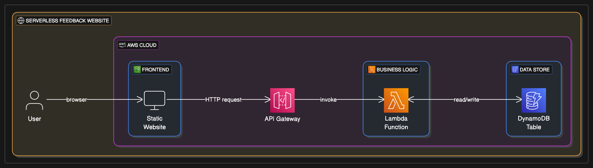

# Serverless Feedback Website

## Project Overview:

This project demonstrates the implementation of a fully serverless feedback collection website using Amazon Web Services (AWS). It provides a secure, scalable, and cost-effective solution for businesses to gather and store customer feedback.

## Problem Statement:

Traditional methods of collecting customer feedback often involve managing dedicated servers, databases, and complex authentication systems. This leads to increased operational overhead, scaling challenges, and higher costs, diverting resources from core business activities. A solution was needed that could efficiently capture feedback without the need for constant infrastructure management.

## Architectural Solution:

The solution leverages a combination of serverless AWS services to create a highly available and scalable feedback platform.

## Frontend (Static Website on S3):

The user-facing feedback form, built with HTML, CSS, and JavaScript, is hosted directly on an AWS S3 bucket configured for static website hosting. S3 provides high availability, scalability, and security for delivering static content globally.

The JavaScript within the frontend handles the submission of feedback data to the backend API.

## Backend (API Gateway, Lambda, DynamoDB):

Amazon API Gateway acts as the secure entry point for feedback submissions. It exposes a RESTful endpoint that the frontend calls. API Gateway manages request routing, throttling, and basic security measures.

An AWS Lambda function is triggered by API Gateway. This function processes the incoming feedback, performs any necessary validation, generates a unique ID, and orchestrates its storage.

Amazon DynamoDB, a fully managed NoSQL database, stores the feedback entries. Its serverless nature ensures automatic scaling to handle varying loads and provides fast, predictable performance without database administration.

## Security (IAM):

AWS Identity and Access Management (IAM) roles and policies are meticulously configured using AWS Serverless Application Model (SAM). This ensures that the Lambda function has only the necessary permissions to interact with DynamoDB (e.g., PutItem) and that API Gateway can invoke the Lambda function, adhering to the principle of least privilege.

## Key Architectural Decisions (KADs):

Serverless-First Approach: Chosen to minimize operational overhead, reduce costs (pay-as-you-go), and enable automatic scalability without manual intervention.

Static Website Hosting on S3: Opted for S3 due to its inherent high availability, scalability, and cost-effectiveness for static content delivery, eliminating the need for web servers.

DynamoDB for Feedback Storage: Selected for its serverless, NoSQL nature, offering seamless scalability and high performance for key-value data storage, perfect for individual feedback entries.

API Gateway for Backend Exposure: Utilized to provide a secure, scalable, and managed interface for the frontend to interact with the Lambda function, handling the complexities of web connectivity.

AWS SAM for Deployment: Chosen to define and deploy the serverless application's resources (Lambda, API Gateway, DynamoDB) in a single, version-controlled template, promoting automation and consistency.

## Architecture Diagram

## Code Examples:

Illustrative code snippets for the frontend, backend Lambda function, and the AWS SAM template for infrastructure provisioning are provided in their respective folders:

frontend/: HTML, CSS, and JavaScript for the feedback form.

backend/: Python code for the AWS Lambda function.

infrastructure/: AWS SAM template (template.yaml) for deploying the AWS resources.

## Outcomes & Benefits:

This project successfully demonstrates a highly scalable, cost-effective, and easy-to-manage solution for collecting and analyzing customer feedback. The serverless architecture ensures:

Scalability: Automatically handles varying loads from a few submissions to millions without manual scaling.

Cost-Effectiveness: Only pay for the compute time and storage consumed, significantly reducing operational costs.

Reduced Management Overhead: No servers to provision, patch, or maintain, allowing focus on application logic.

Faster Development: Accelerates deployment by abstracting away infrastructure concerns.

This approach empowers businesses to focus on improving their products and services based on valuable customer insights, rather than managing complex infrastructure.

## How to Use This Project: A Step-by-Step Guide

This guide will walk you through setting up and demonstrating the Serverless Feedback Platform on your AWS account.

## Prerequisites:

Before you begin, ensure you have the following:

**AWS Account:** An active AWS account with administrative access.

**AWS CLI Configured:** The AWS Command Line Interface (CLI) installed and configured with credentials that have sufficient permissions to deploy CloudFormation stacks, S3 buckets, Lambda functions, API Gateway, and DynamoDB tables.

**Install AWS CLI:** https://docs.aws.amazon.com/cli/latest/userguide/getting-started-install.html

**Configure AWS CLI:** aws configure

**AWS SAM CLI Installed:** The AWS Serverless Application Model (SAM) CLI installed.

**Install SAM CLI:** https://docs.aws.amazon.com/serverless-application-model/latest/developerguide/serverless-sam-cli-install.html

**Python 3.x:** Installed on your local machine.

**Step 1: Clone the Repository**

First, clone this GitHub repository to your local machine:

git clone https://github.com/iamkjn/iamkjn.git # Or your specific portfolio repo URL
cd iamkjn/projects/Serverless-Feedback-Platform-AWS-Architecture/

**Step 2: Review template.yaml**

Open the infrastructure/template.yaml file. There are no specific parameters you must update in this template, as resource names are generated dynamically. However, feel free to review the resource definitions for the S3 bucket, API Gateway, Lambda function, and DynamoDB table.

**Step 3: Deploy the AWS Resources using SAM CLI**

Navigate to the infrastructure/ directory in your terminal:

cd infrastructure/

**Build the SAM application:**

This command packages your Lambda code and prepares the template for deployment.

sam build

**Deploy the SAM stack:**

The --guided flag will walk you through the deployment process, prompting for parameters and confirming changes.

sam deploy --guided

**Stack Name:** Choose a unique name for your CloudFormation stack (e.g., FeedbackPlatformStack).

**AWS Region:** Select the AWS region where you want to deploy (e.g., us-east-1, eu-west-2).

Confirm changes before deploy: Type y to review the changes.

Deploy this changeset?: Type y to proceed with the deployment.

The deployment may take several minutes as AWS provisions the S3 bucket, API Gateway, Lambda function, and DynamoDB table.

**Step 4: Get API Gateway Endpoint and S3 Website URL**

After sam deploy completes, the SAM CLI will output the necessary URLs.

Copy the FeedbackApiEndpoint value from the SAM deployment output in your terminal. This is your API Gateway URL.

Copy the S3WebsiteURL value from the SAM deployment output. This is the URL where your static website is hosted.

**Step 5: Update Frontend script.js**

Open frontend/script.js in your local project.

Replace 'YOUR_API_GATEWAY_ENDPOINT_HERE' with the actual FeedbackApiEndpoint you copied in Step 4.

**Step 6: Upload Frontend Files to S3**

Now that script.js is updated with your API Gateway endpoint, you need to upload the frontend files to the S3 bucket created by SAM.

Navigate to your local frontend/ directory:

cd ../frontend/

Upload the files to your S3 website bucket:
You can use the AWS CLI for this. Replace YOUR_S3_WEBSITE_BUCKET_NAME with the actual name of your S3 website bucket (which is part of the S3WebsiteURL or you can get it from the CloudFormation Outputs as FrontendS3BucketName).

aws s3 sync . s3://YOUR_S3_WEBSITE_BUCKET_NAME --acl public-read --delete

--acl public-read: Makes the files publicly readable for website hosting.

--delete: Deletes files in the S3 bucket that are not present in your local folder (useful for updates).

**Step 7: Test the Feedback Platform**

Open the S3WebsiteURL (copied in Step 4) in your web browser.

Fill out the feedback form and click "Submit Feedback."

Verify Feedback Submission:

You should see a success message on the website.

Go to the AWS DynamoDB Console.

Navigate to Tables and find the table named feedback-table.

Click on the table name, then go to the Explore items tab.

You should see your submitted feedback entry, confirming that the entire platform is working.

**Step 8: Clean Up Your AWS Resources**

To avoid incurring unnecessary AWS charges, it's crucial to clean up all resources after you are done experimenting.

**Delete the SAM Stack:**

Navigate back to the infrastructure/ directory in your terminal:

cd ../infrastructure/
sam delete --stack-name FeedbackPlatformStack # Use the stack name you chose during deployment

Confirm the deletion when prompted. This command will remove all resources created by the SAM template (S3 bucket, API Gateway, Lambda function, DynamoDB table, and associated IAM roles).

Manually Empty and Delete S3 Bucket (if sam delete fails):
Sometimes, sam delete might fail if the S3 bucket is not empty.

Go to the AWS S3 Console.

Select your frontend-s3-bucket (or whatever it's named).

Click Empty to delete all objects, then click Delete to remove the bucket itself.

By following these steps, you can effectively demonstrate your understanding of building serverless web applications on AWS.
